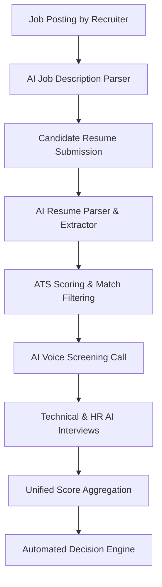

# Zecpath AI - Machine Intelligence Hiring System

Zecpath AI is the intelligent core of the **Zecpath** recruitment platform. It is built to automate the end-to-end recruitment lifecycle—converting unstructured resume data, matching candidates to job roles, facilitating automated AI interviews, and outputting objective, data-driven hiring metrics.

By utilizing advanced Natural Language Processing (NLP), Machine Learning matching models, and telemetry tracking, Zecpath AI minimizes human bias, reduces time-to-hire, and automates manual screening workflows.

---

## 🌟 Key Capabilities & AI Modules

1. **AI Resume & Job Description Parsing**:
   - Extracts raw content from multi-format profiles (`.pdf`, `.docx`) and transforms them into structured JSON.
   - Cleans special characters, standardizes bullet points, and normalizes standard headings (e.g. *Experience*, *Education*, *Skills*).
2. **ATS Scoring & Eligibility Filter**:
   - Cross-references extracted candidate profiles against Job Descriptions (JDs) using text similarity algorithms to generate match scores.
3. **Outbound Voice Call & Screening AI**:
   - Automated voice agent calling for preliminary scheduling, availability confirmation, and basic candidate screening.
4. **Behavioral & HR Evaluation**:
   - Evaluates technical, HR, and behavioral responses, ensuring integrity and tracking visual telemetry.
5. **Unified Aggregated Scorer**:
   - Consolidates score sets across all matching filters and dynamic test rounds into a single hiring decision recommendation.

---

## ⚙️ Core Hiring Workflow



---

## 📂 Directory Structure

```text
zecpath-ai/
│
├── data/                       # Datasets & Processed Files
│   ├── resumes/                # Raw applicant CV files (.pdf, .docx)
│   ├── job_descriptions/       # Recruiter Job Descriptions (.json)
│   ├── transcripts/            # Chat logs and call audio transcriptions
│   └── processed_resumes/      # Normalized cleaned resume text output files
│
├── parsers/                    # Structural Parsers
│   ├── __init__.py
│   └── resume_extractor.py     # PDF & DOCX text extraction, cleaning & normalization
│
├── ats_engine/                 # Job matching algorithms
│   ├── __init__.py
│   └── ats_scorer.py
│
├── screening_ai/               # Voice screening algorithms
│   └── screening_engine.py
│
├── interview_ai/               # HR & Technical assessment systems
│   └── interview_engine.py
│
├── scoring/                    # Candidate aggregation models
│   └── scoring_engine.py
│
├── utils/                      # Helper Libraries
│   ├── __init__.py
│   ├── logger.py               # Central event logging system
│   └── generate_resumes.py     # Batch mock resume generator utility
│
├── tests/                      # Automated unit test scripts
│   ├── __init__.py
│   └── test_resume_extractor.py
│
├── main.py                     # Entry point (reserved for future web/server startup)
├── run_d5_parser.py               # Batch pipeline runner for text extraction
├── requirements.txt            # Project dependencies manifest
├── .gitignore                  # Git exclusion configuration
└── README.md                   # Project overview & documentation
```

---

## 🚀 Getting Started

### 1. Set Up Virtual Environment

Open your terminal (recommended Git Bash for Windows), navigate to the project root, and execute:

```bash
# Create the python virtual environment
python -m venv venv

# Activate the environment (Git Bash)
source venv/Scripts/activate

# Or activate on PowerShell
# venv\Scripts\activate
```

### 2. Install Project Dependencies

Install the NLP, document parsing, and testing framework dependencies:

```bash
pip install -r requirements.txt
```

### 3. Generate Mock Test Resumes

If the `data/resumes/` folder is empty, you can automatically generate 10 professional resumes representing different engineering/machinist trades:

```bash
python utils/generate_resumes.py
```

### 4. Execute the Candidate Resume Batch Parser
To clean and extract text from all raw resumes inside `data/resumes/` in a batch:
```bash
python run_d5_parser.py
```
*Parsed candidate texts are saved in `data/processed_resumes/`.*

### 5. Execute the Job Description Batch Parser
To parse all split job descriptions inside `data/jd/` and generate structured JSON profiles:
```bash
python run_d6_jd_parser.py
```
*Structured JD JSON profiles are saved in `data/processed_jds/`.*

### 6. Execute the Full Scoring & Matching Pipeline (Days 6-10)
To run the end-to-end recruitment matching dashboard comparing candidates against target JD constraints:
```bash
python run_pipeline.py
```
*Structured candidate profiles in JSON format are saved in `data/processed_profiles/`.*

### 7. Running Automated Unit Tests
To run all automated unit tests verifying parsing logic, classifiers, extractors, and calculations:
```bash
python -m pytest
```

---

## 📊 Centralized Logging

All system events, parsed files, and exception tracebacks are recorded inside the central log file:
*   **File Location**: [ai_logs.log](file:///c:/Users/kutta/OneDrive/Desktop/zecpath/ai_logs.log)

